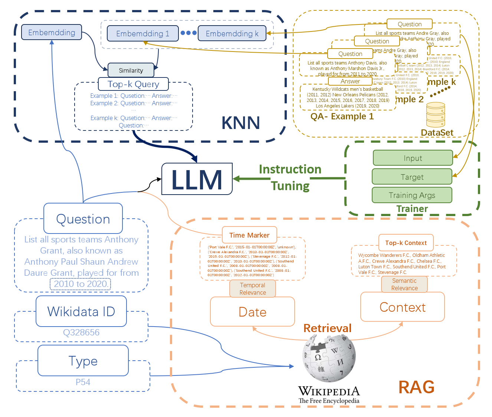

# Timeline-based-List-Question-Answering

Hi everyone! It is our NLP project in LLM, with authors: [Box](https://github.com/baimuchu), [MeowDai](https://github.com/MeowDai), [Zhuoran](https://github.com/wang-zhuoran), [Barry](https://github.com/Bzz77). If you have any questions, you can contact Me ([Box](https://github.com/baimuchu)).

## Project Introduction

   

We implemented in Timeline-based-List-Question-Answering problem, specifically the desire to be able to generate structured QA, by using a question and answer [dataset](https://github.com/VenkteshV/TLQA_NLP_Porject/) containing time.

## Project Structure
Our project contains multiple subtasks, you can click the different subtitles to check different Tasks.

### [**KNN Few-shot**](https://github.com/wang-zhuoran/Timeline-based-List-Question-Answering/tree/KNN)
 - KNN: K is top-k, and NN means Nearest Neighbour based on cosine similarity.
 - Few-shot: The Q&A pairs found by KNN will fed to LLM model with original question.

### [**Fine-tuning**](https://github.com/wang-zhuoran/Timeline-based-List-Question-Answering/tree/fine-tuning)
 - Fine-tuned based on the instructions tuning

### [**RAG**](https://github.com/wang-zhuoran/Timeline-based-List-Question-Answering/tree/fine-tuned-model-with-RAG)
 - We complete the RAG on Wikipedia.
 - The top-k entities are found through the retrieved context using similarity.
 - We combined the retrieved text with the original question and fed it to LLM as a prompt.

 ### [**RAG with time marker**](https://github.com/wang-zhuoran/Timeline-based-List-Question-Answering/tree/TempRet)
 - Similar to RAG, we introduce a Temporal Relevance metric and find temporal similarity.
 - Combine the retrieved text, the time marker, and the original question as the prompt.

 ### [**Evaluation Metrics**](https://github.com/wang-zhuoran/Timeline-based-List-Question-Answering/blob/main/evaluate/compute_metrics.ipynb)
 - Introduce Entity Match Metric, Timeline Match Metric, F1 Metric, Absolute Time Differences  Metric, Completeness Metric
